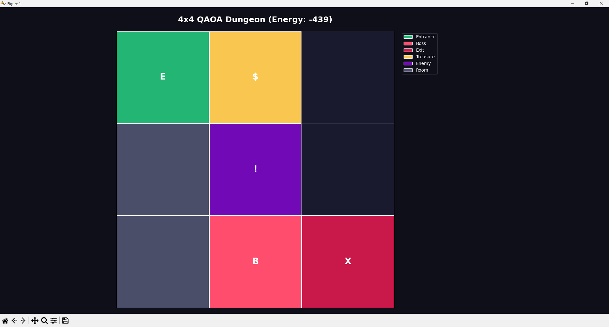
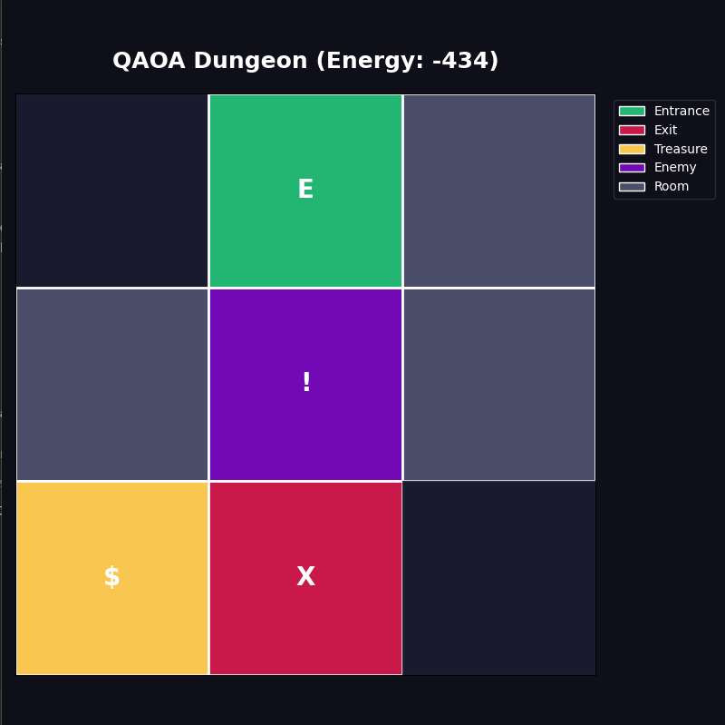
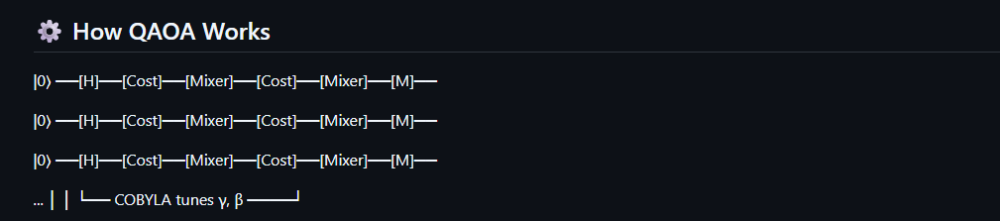
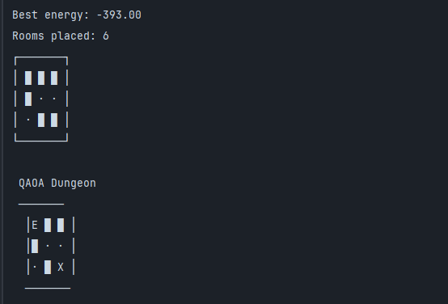

# Quantum Dungeon Generator


A procedural dungeon generator powered by real quantum computing. Instead of traditional random generation, dungeon layout constraints are encoded as a **Quadratic Unconstrained Binary Optimization (QUBO)** problem and solved using the **Quantum Approximate Optimization Algorithm (QAOA)** via IBM Qiskit. Each grid cell becomes a qubit — the quantum circuit explores all possible dungeon layouts simultaneously before collapsing to an optimal solution.

---

## 📸 Preview

### Generated Dungeon — 4x4 Grid (Energy: -439)


### Generated Dungeon — 3x3 Grid (Energy: -434)


### Quantum Circuit — QAOA Structure


### Terminal Output — Energy & Room Placement


---

## 🤔 Why Quantum?

Traditional procedural dungeon generation uses random algorithms: BSP trees, cellular automata, random walks. These are fast but make locally greedy decisions without globally optimising the layout.

QAOA frames dungeon generation as an **optimisation problem**: given a grid of N cells, find the binary assignment (room / no room) that best satisfies all design constraints simultaneously, connectivity, room count, entrance/exit placement, while maximising layout quality.

The quantum advantage is that a QAOA circuit with N qubits exists in a **superposition of all 2^N possible layouts** simultaneously. The cost and mixer layers iteratively amplify the probability of high-quality solutions before measurement collapses the state to the optimal layout.

For a 4x4 grid this means evaluating **65,536 possible dungeons simultaneously** in a single quantum circuit execution.

---

## ✨ Features

- ⚛️ **QAOA Solver** Quantum superposition explores all possible dungeon layouts simultaneously, finding globally optimal room placements
- 🧮 **QUBO Encoding** Translates game design rules (room count, connectivity, entrance/exit placement) into mathematical constraints solved by the quantum circuit
- 🔗 **Connectivity Validation** Flood-fill algorithm ensures all rooms are reachable; disconnected dungeons are rejected and regenerated automatically
- 🏰 **Room Type Assignment** Automatically places Entrance, Exit, Boss, Treasure, and Enemy rooms based on layout topology
- 📊 **Dual Visualisation** ASCII terminal output and full-colour Matplotlib grid with room type legend
- 🔄 **Retry Logic** Regenerates layouts until a fully connected dungeon is found
- 📉 **Energy Reporting** Reports the QUBO cost function energy of the final layout

---

## 📸 Sample Output

**Terminal output:**
```
Grid: 4x4
Total cells: 16
Best energy: -439.00
Rooms placed: 6

QAOA Dungeon
─────────────────
| E  $  ·  · |
| ·  !  ·  · |
| ·  B  X  · |
─────────────────
```

**Room type legend:**

| Symbol | Type | Description |
|---|---|---|
| E | Entrance | Starting point — placed in top row |
| X | Exit | Goal — placed in bottom row |
| B | Boss | Guardian room — adjacent to exit |
| $ | Treasure | Reward rooms |
| ! | Enemy | Combat encounters |
| ■ | Room | Generic connected room |
| · | Empty | No room |

---

## ⚛️ How QAOA Works

```
|0⟩ ──[H]──[Cost U(γ,C)]──[Mixer U(β,B)]──[Cost U(γ,C)]──[Mixer U(β,B)]──[Measure]──
|0⟩ ──[H]──[Cost U(γ,C)]──[Mixer U(β,B)]──[Cost U(γ,C)]──[Mixer U(β,B)]──[Measure]──
|0⟩ ──[H]──[Cost U(γ,C)]──[Mixer U(β,B)]──[Cost U(γ,C)]──[Mixer U(β,B)]──[Measure]──
        └──── COBYLA optimizer tunes γ, β parameters ────┘
```

| Step | Operation | Description |
|---|---|---|
| 1 | **Hadamard (H)** | Creates superposition of all 2^n possible dungeon layouts |
| 2 | **Cost Layer U(γ,C)** | Applies dungeon constraints as phase rotations |
| 3 | **Mixer Layer U(β,B)** | Enables exploration of the solution space |
| 4 | **Repeat** | Multiple cost-mixer layers improve solution quality |
| 5 | **COBYLA Optimizer** | Classical optimizer tunes γ, β parameters to minimise cost |
| 6 | **Measurement** | Collapses superposition to optimal dungeon layout |

---

## 🏗️ Architecture

| Component | Role | Output |
|---|---|---|
| 🎮 **DungeonGrid** | Defines grid size, target rooms, neighbour relationships | Constraint parameters |
| 🧮 **QUBO Builder** | Encodes room count penalty, connectivity reward, entrance/exit preference | Cost function |
| ⚛️ **QAOA Circuit** | Quantum superposition + cost/mixer layers | Parameterised circuit |
| 🔧 **COBYLA Optimizer** | Classical tuning of quantum parameters γ, β | Optimal angles |
| 📏 **Measurement** | Collapses quantum state to classical bitstring | Binary room layout |
| ✅ **Connectivity Check** | Validates all rooms are reachable via flood-fill | Pass/retry |
| 🏰 **Room Assigner** | Places Entrance, Exit, Boss, Treasure, Enemy | Typed layout |
| 🎨 **Visualizer** | Renders ASCII terminal output and Matplotlib grid | PNG output |

---

## 🗂️ Project Structure

```
Quantum-Dungeon-Generator/
├── src/
│   ├── dungeon.py          # DungeonGrid class, RoomType enum, connectivity check, room assignment
│   ├── quantum_core.py     # QuantumDungeonSolver, QUBO builder, QAOA runner
│   ├── visualizer.py       # print_dungeon(), plot_dungeon(), colour schemes
│   └── __init__.py         # Package exports
├── assets/                 # Screenshots for README
├── main.py                 # Entry point with formatted console output
├── requirements.txt        # Qiskit, NumPy, Matplotlib
└── README.md
```

---

## 🚀 Getting Started

### Prerequisites

- Python 3.12+
- pip

### Installation

```bash
# Clone the repository
git clone https://github.com/alvarogope/Quantum-Dungeon-Generator.git
cd Quantum-Dungeon-Generator

# Create virtual environment
python -m venv venv
.\venv\Scripts\activate  # Windows
source venv/bin/activate  # macOS/Linux

# Install dependencies
pip install -r requirements.txt

# Run the generator
python main.py
```

---

## 🛠️ Tech Stack

| Layer | Technology |
|---|---|
| Quantum Computing | Qiskit, Qiskit-Aer, Qiskit-Algorithms, Qiskit-Optimization |
| Optimisation | QAOA (Quantum Approximate Optimization Algorithm), COBYLA |
| Data | NumPy |
| Visualisation | Matplotlib |
| Language | Python 3.12+ |

---

## 🎓 Research Context

This project explores the intersection of quantum computing and video game design, specifically whether quantum optimisation algorithms can produce dungeon layouts with better global connectivity and design constraint satisfaction than classical random generation. The QUBO formulation allows game design rules to be expressed as mathematical penalties, creating a direct bridge between game design intent and quantum circuit construction.

Related field: **Quantum Game Theory** and **Quantum-assisted Procedural Content Generation (PCG)**.
